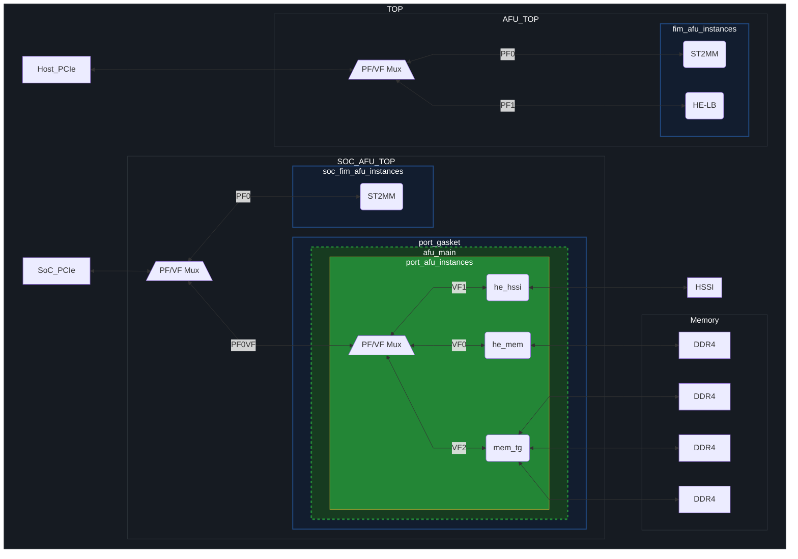

# Accelerator Functional Unit (AFU) Top-level

This project area defines the top-level implementation of the AFU design. This includes the PF/VF routing to the various hierarchies and endpoints (described below), the endpoint behaviors, as well as connectivity to board peripherals (local memory, HSSI, HPS). In the SoC Attach FIM there are two separately composed AFUs for Host and SoC features.

The reference AFU topology is:

## Top-Level Modules

### PF/VF Mux
The PF/VF mux (`$OFS_ROOTDIR/ofs-common/src/common/lib/mux/pf_vf_mux_w_params.sv`) routes AXI-ST TLP requests from the PCIe subsystem to ports defined in [top_cfg_pkg.sv](mux/top_cfg_pkg.sv). The reference implementaiton provides two mux hierarchies:
* a top mux which is the root routing as follows:
    * SoC: `PF0 -> Port 0`, `PF0VF -> Port 1`.
    * Host: `PF0 -> Port 0`, `PF1 -> Port 1`.
* a mux in the Partial Reconfiguration (PR) region attached to SoC `Port 1` that routes every SoC `PF0VF` to a separate port.

### FIM AFU Instances

[fim\_afu\_instances.sv](fim_afu_instances.sv) contains the static region (SR) AFU endpoints. The OFS reference implementation contains a seperate AXI-ST port for every PF/VF routed to this region:
* PF0 is routed to ST2MM (`$OFS_ROOTDIR/ofs-common/src/common/st2mm`) which translates AXI-ST TLP requests/completions from PCIe to AXI-Lite transfers connected to the OFS management fabric (APF/BPF).
* PF1 is routed to HE-Loopback
* all other PCIe functions are routed to instances of the null exerciser: HE-Null

### Port Gasket

The port gasket (`$OFS_ROOTDIR/ofs-common/src/fpga_family/agilex/port_gasket`) is attached to the SoC and implements the Partial Reconfiguration (PR) feature as well as supporting features for a PR design like remote signal tap and user clock. It also contains the PR boundary hierarchy and attaches to the PF0VF port.
